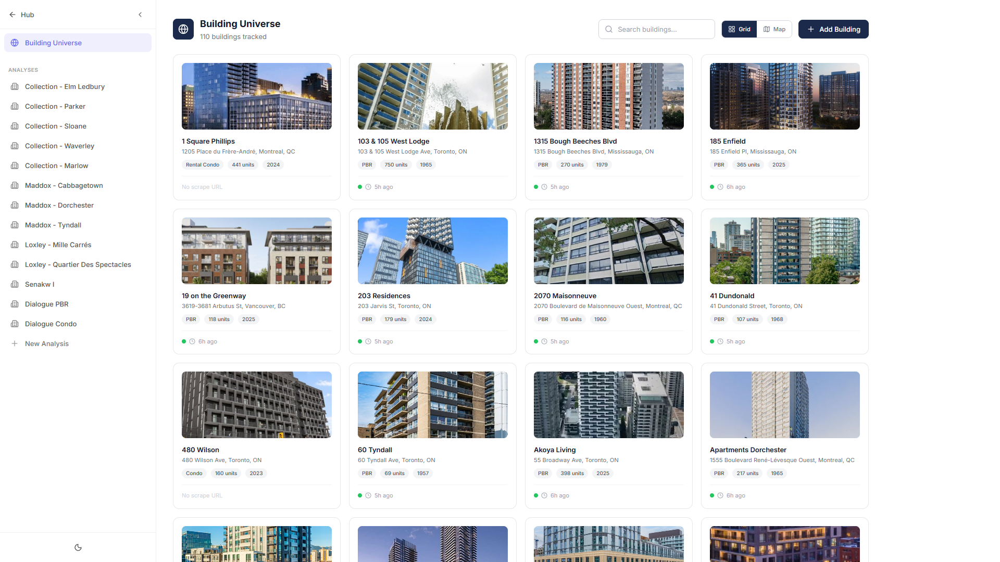
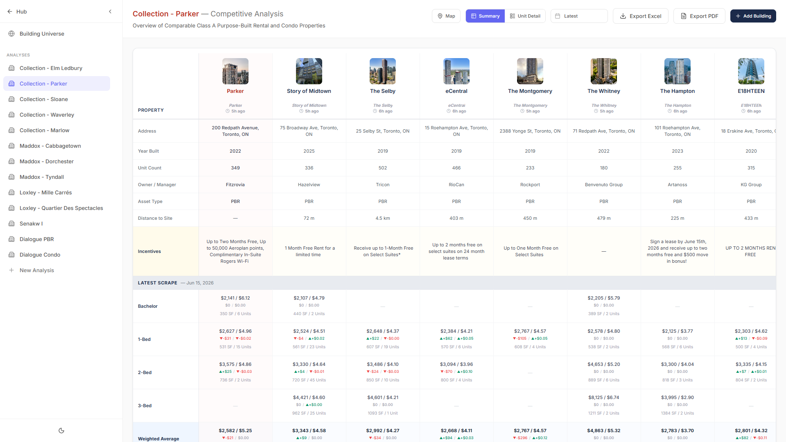
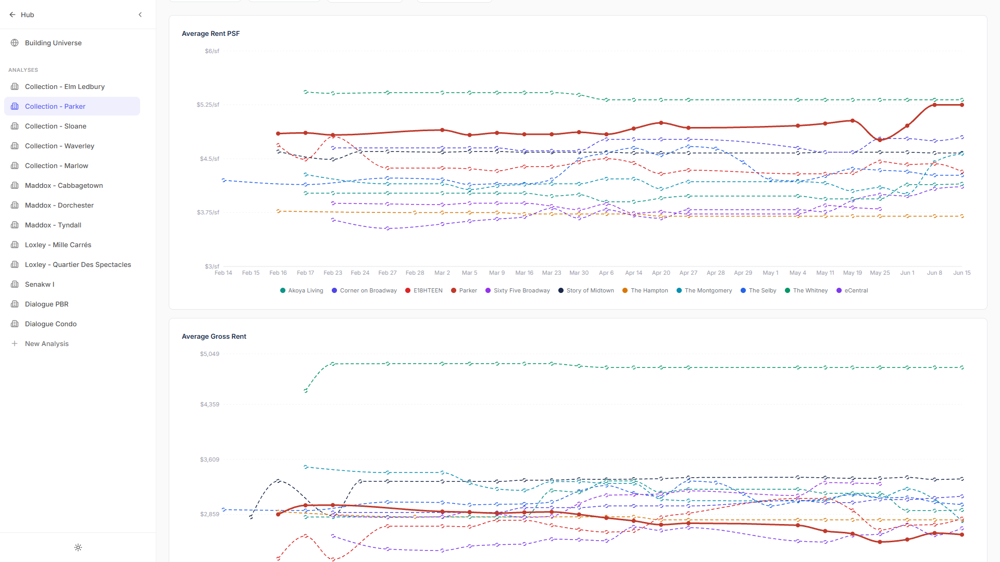
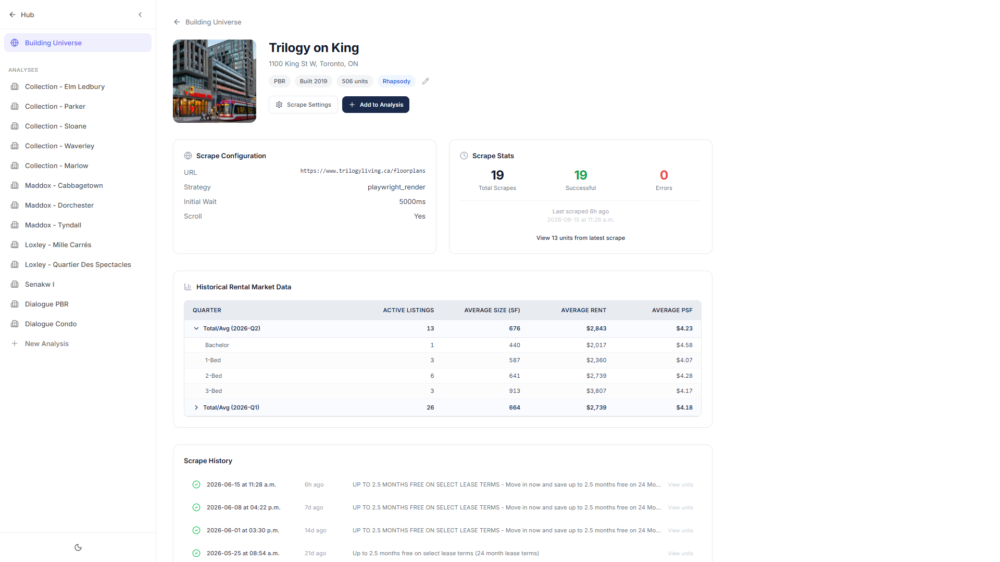
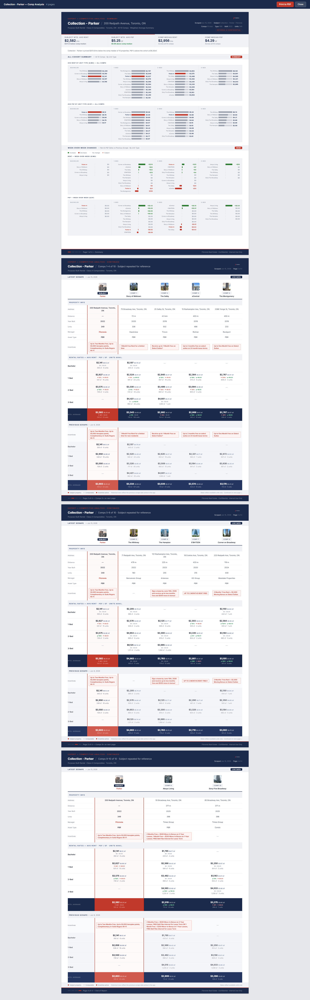

# Frontend Design

The visual design of the Comp Tracker web app — colors, type, layout, and the key
UI patterns — so the front end can be rebuilt with fidelity. This is the **design**
layer; how the UI *reads data* is in [DATA_STORAGE.md](DATA_STORAGE.md).

Stack: **React 19 + Vite + Tailwind CSS v3**, Recharts (charts), React-Leaflet
(maps), html2canvas (PDF). Code referenced by path under `fitzrovia-app/src/`.

Design source of truth in the repo: `docs/design/DESIGN_SYSTEM.md` (v2.6.0).
Live design-system tokens: `fitzrovia-app/src/index.css`;
Tailwind theme: `fitzrovia-app/tailwind.config.js`.

---

## Design language

**Hybrid theme.** The *chrome* (sidebar, headers, modals) is theme-aware via CSS
variables (`--surface-primary`, `--bg-base`, `--border-subtle`, …) and supports
dark mode. The *data area* (comp tables, charts, PDF) is **forced light/white** —
dense numbers scan better on white, so it ignores dark mode by design. Keep this
split if you rebuild.

**Brand palette (the colors that define Comp Tracker):**

| Token | Hex | Used for |
|---|---|---|
| Navy | `#1B2A4A` | table headers, strong text, modal icon chips, map comp markers, cluster icons, primary buttons |
| Crimson | `#C0392B` | **benchmark** building name, benchmark chart line, KPI/variance accents |
| Fitzrovia Orange | `#F26522` | benchmark map marker, active sidebar link |
| White | `#FFFFFF` | data area / chart / modal backgrounds |
| Light gray | `#F8F9FA` | section-header backgrounds, PDF fills |
| Border | `#E5E7EB` | grid lines, table/modal/chart borders |

**Chart line palette** (benchmark first, then comps in order): `#C0392B` (benchmark),
`#1B2A4A`, `#2563EB`, `#7C3AED`, `#0891B2`, `#059669`, `#D97706`, `#DC2626`, `#4F46E5`,
`#0D9488`, `#9333EA`. Defined in `components/trendColors.ts`.

**Typography.** Body/UI font **Inter** (400/500/600/700) via Google Fonts
(`index.html`). Display fonts (`Bebas Neue`, `Cormorant Garamond`) exist app-wide but
are **not** used in Comp Tracker. Scale (tailwind): xs 11px, sm 13px, base 14px,
lg 16px, xl 18px, 2xl 24px. Numbers use `tabular-nums`.

**Spacing/rounding.** 4px base scale (`p-2`=8 … `p-6`=24). Radii: sm 4 / md 6 /
lg 8 / xl 12 / 2xl 16px. Shadows: xs/sm/md/lg per tailwind config.

**Benchmark visual hierarchy** (a recurring motif): the Fitzrovia benchmark is
always crimson, thicker, solid, filled — comps are thinner, dashed, hollow. This
holds across the table, the charts, and the maps.

---

## Layout — `CompTrackerLayout.tsx`
A **standalone** shell (not the app-wide `AppLayout`), because the nav is a list of
analyses.

- **Sidebar** `300px` (collapses to `64px` on desktop; a fixed drawer on mobile,
  breakpoint `768px`). Header `56px`. Top: "Hub ←" back link. Then a **Building
  Universe** link, then the **ANALYSES** list (each `fitz_property`), a **+ New
  Analysis** button, and a theme toggle at the bottom. Active item uses
  `--accent-primary` subtle background.
- **Main content** `flex-1`, `bg-[var(--bg-base)]`, scrollable. Renders one of:
  `PropertyDashboard`, `BuildingUniverse`, or `BuildingDetail`.

---

## Key UI patterns

### Comp table — `components/CompTable.tsx`
The signature screen. Container `bg-white rounded-xl shadow-sm border-gray-200`.
- **Grid:** sticky left **row-label** column `160px`; data columns `180px` each;
  **benchmark** is the first data column, tinted `bg-red-50/30`. A top scrollbar is
  synced to the table's horizontal scroll.
- **Row groups (top→bottom):** building photo (`w-16 h-16 rounded-lg`) → building
  name (`font-bold`, crimson for benchmark) → scrape info → **Incentives** (admin
  `EditableCell`) → per unit-type sections (Bachelor / 1-Bed / 2-Bed / 3-Bed, each
  with Gross Rent, PSF, Avg Size rows) → weighted averages → optional previous-week
  block.
- **Headers:** navy `#1B2A4A`, `text-xs`, uppercase, `tracking-wider`, `font-semibold`.
- **WoW delta badge:** `▲` emerald-600 / `▼` red-500 / neutral gray-400, `text-[9px]`,
  formatted `$±XXX` or `$±X.XX/sf`.
- Editable cells (`EditableCell.tsx`) for admins; click a cell → `UnitDetailTable`
  drill-down; click a building → `BuildingDetail`.

### Trend charts — `components/RentTrendSection.tsx` + `TrendLineChart.tsx`
Two Recharts line charts (**Avg Gross Rent**, **Avg Rent PSF**) in white cards
(`rounded-lg border-[#e5e7eb] p-6`), `height≈480`. Horizontal-only grid
(`strokeDasharray 3 3`, `#e5e7eb`), axes `#9ca3af` 11px, Y-axis `$`-formatted with a
non-zero domain (5% padding). Custom tooltip (white, `shadow`, benchmark sorted
first) and custom legend (dot + label). Line styling per the benchmark-vs-comp motif
above; `connectNulls` so gaps in a building's history don't break the line. Filters:
unit-type multi-select, building multi-select, date range.

### Maps — `components/AnalysisMap.tsx`, `BuildingUniverseMap.tsx`, `leafletSetup.ts`
React-Leaflet on the **CartoDB Positron** grayscale basemap. Custom `L.divIcon`
markers: benchmark = orange `#F26522` circle + white star (36px); comp = navy
`#1B2A4A` circle + building glyph (32px); clusters = navy circle with white count
(`react-leaflet-cluster`). Hover tooltip shows a 44px photo + navy building name.
`AnalysisMap` is `300px` tall (on the dashboard); `BuildingUniverseMap` is full-height
with per-city zoom buttons. `fitBounds` auto-frames all markers.

### Modals — `AddBuildingModal`, `NewAnalysisModal`, `BuildingSettingsModal`, …
Shared pattern: `bg-black/50` backdrop + centered `bg-white rounded-xl shadow-2xl
max-w-lg`. Header has a navy `#1B2A4A` rounded icon chip + `text-base font-semibold`
navy title + close `X`; scrollable body `p-5`; footer with right-aligned Cancel
(ghost) + navy primary button. Inputs: `border-gray-200 focus:border/ring-[#1B2A4A]`.

### PDF / print — `pdf/PrintableReport.tsx`, `pdf/pdfConstants.ts`
US-Letter portrait, rendered at 1160×1501px and scaled to print via `zoom: 0.703`
(print rules live in `index.css` `@media print`). **Inline styles only** — html2canvas
can't read Tailwind classes or CSS gradients in the hidden render DOM (hence
`STRIPE_SVG` data-URI for empty comp columns and a base64 logo, both in
`pdfConstants.ts`). Page 1: navy header + KPI strip + comp table (≤4 comps). Pages
2-N: mini navy header + more comps. Final page: diverging variance bar charts.
Colors: navy `#1B2A4A`, crimson `#C0392B`, positive green `#117A34`, body `#333`.

---

## Notable, deliberate decisions
1. **Data area is always light** — even in dark mode.
2. **Standalone layout** — Comp Tracker does not reuse the app `AppLayout`/`Sidebar`.
3. **Inline styles for brand/dynamic colors** (map markers, modal chips, PDF) —
   everything else is Tailwind utility classes.
4. **Custom Recharts tooltip/legend + custom Leaflet divIcons** for full brand control.

---

## Visual reference (screenshots)
Live captures of the running app (light mode, 1920×1080), in
[`screenshots/`](screenshots/). Analysis shown: **Collection - Parker**.

### Building Universe — the building registry (card grid; has a map toggle)

### Property Dashboard — the comp table
The signature view: benchmark first (tinted), comps in order, incentives row,
per-unit-type rents with week-over-week deltas, weighted average.

### Property Dashboard — rent trend charts
Avg Rent PSF + Avg Gross Rent over the full scrape history. Benchmark (Parker) is
solid red/thick; comps are dashed/colored — the benchmark-vs-comp motif.

### Building Detail — scrape config, stats, historical rental data
Per-building page: the `scrape_config` summary, scrape success/error stats, the
quarterly **Historical Rental Market Data** rollup, and the scrape/incentive timeline.

### PDF / print report
The multi-page printable report (KPI strip, variance charts, navy comp-table pages).

### Regenerating these
There's no `--page=comp-tracker` in the app's `npm run screenshot` harness — that
harness covers the other Hub tools, but Comp Tracker needs an analysis selected.
These were captured with a short Puppeteer script that logs in (test creds in
`fitzrovia-app/.env`) and visits the routes directly: `/comp-tracker` (universe),
`/comp-tracker/analysis/<fitz_property_id>` (dashboard + the print route), and
`/comp-tracker/building/<comp_building_id>` (detail). IDs come from
[`../db/seed/`](../db/seed/). Dark mode isn't shown because the data area is
light-only by design.
